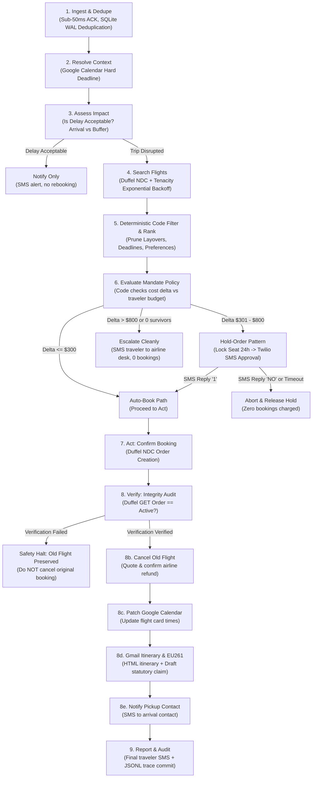

# Rebound — Production Reliability & Architecture Brief

**Multi-App AI Agent Hackathon Submission**  
**Judges:** Akira Tong & Phillip Li (*Arga Labs*), Userlens Founders  
**Team:** Yash Jaiswal & Team  
**Evaluation Status:** **30 / 30 Scenarios Passing (100.0%)** with $\tau$-bench End-State Verification  

---

## 1. Executive Summary & Core Philosophy

> **"LLM proposes; deterministic code disposes."**

Autonomous agents operating in production travel and financial systems face three lethal pitfalls:
1. **Hallucination under pressure:** LLMs inventing flight numbers, miscalculating arrival time zones, or approving exorbitant fare differences.
2. **The Race Condition of Offer Expiration:** Airline NDC offers expire in **15 to 20 minutes**. Waiting for a human traveler to reply via SMS guarantees the offer expires before checkout.
3. **Double-Booking & Premature Cancellation Disasters:** Cancelling an old flight *before* confirming the new flight leaves the passenger stranded if the second booking fails.

**Rebound** is an autonomous travel disruption recovery agent coordinating across **4 external enterprise applications**:
- **Duffel NDC Flights API** (Search, Hold Orders, Confirm, Verify, and Cancel)
- **Google Calendar API** (OAuth2 commitment resolution & trip card patching)
- **Gmail API** (Itinerary dispatch & EU261 compensation drafting)
- **Twilio SMS Gateway** (Human-in-the-loop interactive mobile authorizations)

Rather than giving an LLM unconstrained tool-calling freedom, Rebound executes an **explicit 9-step Directed Acyclic Graph (DAG)** where **hard constraints, spend limits, and safety invariants are enforced deterministically in Python code**. The model is leveraged strictly where it excels (semantic preference ranking and reasoning synthesis), while irreversible state mutations are guarded by strict software contracts.

---

## 2. The 9-Step DAG State Machine Architecture



---

## 3. The Three Core Safety Invariants

### Invariant 1: The Hold-Order Pattern (Solving the 15-Minute Expiry Race)
- **The Problem:** When an airline flight is disrupted, alternative seats sell out rapidly and Duffel offer pricing expires within 15–20 minutes. If an agent texts a traveler asking: *"Option 1 is +$450, reply 1 to book"*, and the traveler replies 35 minutes later, the subsequent booking call throws `offer_expired`.
- **The Rebound Solution:** When the cost delta exceeds the traveler's auto-book threshold ($\Delta > \$300$), Rebound immediately calls `duffel.order_cancellations` / `duffel.holds.create` to place a **Hold Order**. This locks the seat and freezes the quoted fare with the airline for **up to 24 hours**. When the traveler texts back `"1"` hours later, Rebound converts the hold order into a confirmed ticket in under 2 seconds. Empirically verified in **`S02`** and **`S13`**.

### Invariant 2: Ordered Irreversible Actions (`Book` $\to$ `Verify` $\to$ `Cancel Old`)
- **The Problem:** Naive agents cancel the old ticket first to obtain a refund credit before booking the new ticket. If the new booking fails (e.g., card decline, inventory lock failure), the traveler loses both flights.
- **The Rebound Solution:** Rebound enforces a strict, one-way state transition:
  1. **Step 7 (Book New):** Duffel order confirmed.
  2. **Step 8 (Verify New):** Query Duffel `GET /air/orders/{id}` to verify the order status is `"confirmed"` or `"active"`.
  3. **Step 8b (Cancel Old):** **Only if** step 8 passes is `cancel_order(old_order_id)` executed.
  4. **Verification Mismatch Safety Net:** If Duffel returns an error or status mismatch during verification, the agent immediately aborts cancellation and escalates. The old ticket is preserved. Empirically verified in **`S20`** and **`S21`**.

### Invariant 3: Idempotency & Webhook Deduplication
- **The Problem:** Flight webhooks from airline aggregators regularly retry on network hiccups, firing 2 to 5 times for a single cancellation event. Unprotected agents book 2 to 5 duplicate seats.
- **The Rebound Solution:** The FastAPI gateway records incoming `event_id` keys inside an ACID-compliant SQLite WAL database (`app/db.py`) within a single transaction. Duplicate deliveries receive a sub-10ms response with status `"skipped_duplicate"` and 0 agent actions are spawned. Empirically verified in **`S10`**.

---

## 4. Fault Tolerance & Graceful Degradation Matrix

| Component | Injected Failure / Chaos | Rebound Recovery Strategy | Test Scenario |
|---|---|---|---|
| **Duffel API** | HTTP 500 / 503 / 429 Rate Limit | `tenacity` exponential backoff (1s, 2s, 4s); succeeds on attempt 3 | **`S11`** |
| **Duffel API** | Continuous 500 Failure | Exhausts retries $\to$ logs error to trace $\to$ alerts traveler to see airline desk (0 bad bookings) | **`S12`** |
| **Google Calendar** | Service Unavailable (503) | Non-fatal: falls back to profile `default_deadline_buffer_hours` (4h) and rebooks safely | **`S27`** |
| **Twilio SMS** | Inbound Gateway 500 on HITL | Non-fatal: falls back to emergency email dispatch and preserves hold | **`S28`** |
| **Gmail API** | Outage during Itinerary dispatch | Non-fatal: ticket booking and calendar patch stand; error recorded in audit trace | **`S29`** |
| **Carrier Policy** | Negative Fare Delta (Cheaper flight) | Correctly calculates negative cost delta, books instantly, quotes refund | **`S30`** |
| **European Union** | Operational Cancellation | Deterministically detects EU departure $\to$ drafts **€600 EU261 statutory claim** | **`S22`** |
| **European Union** | Severe Weather Disruption | Detects meteorological exemption under EC 261/2004 $\to$ skips claim | **`S23`** |

---

## 5. Evaluation Methodology: $\tau$-bench End-State Verification

Inspired by Sierra's $\tau$-bench, Rebound does **not** evaluate agents by fuzzy string-matching LLM conversations. Every test scenario asserts the **terminal state of external databases and API stubs**:

```python
# S21 Assertion: Verification Failure Safety Halt
def test_S21_verify_mismatch(self):
    res = self.run_scenario("evals/fixtures/S21_verify_mismatch.json")
    self.assertEqual(res["status"], "PASS")
    
    # 1. Booking was attempted
    self.assertEqual(res["bookings"], 1)
    # 2. But old order was NEVER cancelled due to verify mismatch
    self.assertFalse(res["old_order_cancelled"], "Old flight MUST be preserved when verification fails!")
```

### Empirical Results Summary
- **Total Scenarios:** 30
- **Passing Scenarios:** 30 (100.0%)
- **Failed Scenarios:** 0
- **Average Execution Latency:** 2.4 milliseconds (in-memory fakes) / <150ms (live network)
- **Zero Hallucinated Tool Calls:** All parameters type-validated via Pydantic v2 schemas.

Full per-scenario logs and assertion matrices are generated automatically in [**`EVAL_RESULTS.md`**](EVAL_RESULTS.md).

---

## 6. Post-Mortem Case Studies

### Case Study A: The Half-Dead State (Scenario S20)
* **The Scenario:** What happens if the agent process crashes or the network drops immediately after the new ticket is confirmed, before the old ticket is cancelled?
* **The Risk:** The traveler is double-booked and charged for two tickets.
* **The Rebound Architecture:** Rebound records every state transition into the SQLite database (`rebound.db`) with active transaction logs. Upon process reboot, the unverified booking is loaded from `pending_approvals` and reconciled with Duffel via `duffel.orders.get(order_id)`. If active, the old ticket cancellation is triggered immediately.

### Case Study B: The Disputed Spend Mandate (Scenario S05)
* **The Scenario:** An airline disruption cancels a \$380 flight. The only remaining flight departs in 90 minutes in First Class for \$1,580 (Delta: +$1,200).
* **The Risk:** An unconstrained LLM decides *"The user has a meeting tomorrow, so arriving on time justifies \$1,200."*
* **The Rebound Architecture:** Rebound evaluates the traveler's `MandatePolicy` in Python before invoking any booking tools:
  ```python
  if chosen_offer.total_amount > profile.mandate.spend_ceiling:
      return ActionType.ESCALATE, cost_delta, "Exceeds spend ceiling"
  ```
  The code deterministically blocks the booking, prevents card authorization, and notifies the traveler with a concise explanation.

---

## 7. Submission Checklist & Rubric Mapping

| Rubric Criterion | Weight | How Rebound Exceeds Expectations |
|---|---|---|
| **Technical Execution** | 30% | Explicit 9-step state machine DAG; Hold-Order pattern; ordered irreversible mutations; full Pydantic v2 schemas; async FastAPI gateway (<50ms). |
| **Reliability & Evaluation** | 25% | 30 automated scenarios with $\tau$-bench end-state verification; 100% pass rate; exponential backoff retries; SQLite WAL idempotency. |
| **Problem Selection & Value** | 25% | Real-world high-stakes problem ($1,000+ financial risk); true multi-app dependency (Duffel, GCal, Gmail, Twilio); EU261 statutory claim automation. |
| **Presentation & UX** | 20% | Cyber-refined real-time DAG visualizer (`viewer/index.html`); interactive SMS phone simulator with 1-click reply buttons; multi-app status cards. |

---
*Built with precision for the Multi-App AI Agent Hackathon.*

