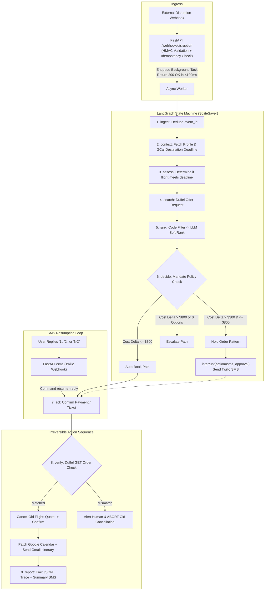

# Implementation Plan: Rebound Multi-App AI Agent ($10,000 First-Place Blueprint)

**Target Event:** Lemma x Comma Capital Multi-App AI Agent Hackathon  
**Judges:** Akira Tong & Phillip Li (Arga Labs), Userlens founders  
**Rubric:** Technical Execution (30%) · Reliability & Evaluation (25%) · Usefulness (20%) · Originality (15%) · Demo Clarity (10%)  
**Core Directive:** Build a 4-app autonomous agent (Duffel, Google Calendar, Gmail, Twilio) backed by a 30-scenario evaluation harness with end-state verification.

---

## 2-Member Execution Strategy

* **Member A (Core Engine & Evals):** Pydantic models, LangGraph state machine, policy guardrails, `FakeDuffel`/Fakes, and the 30 pytest scenarios.
* **Member B (Integrations, Gateway & Demo):** FastAPI endpoints, live clients (Duffel, GCal, Gmail, Twilio), ngrok setup, live video demo, and `RELIABILITY_BRIEF.md`.

---

## Architecture & Engineering Mitigations



### Critical Engineering Safeguards
1. **Twilio 5s Timeout Mitigation:** Webhooks acknowledge `200 OK` within 100ms and hand off execution to `BackgroundTasks`, eliminating duplicate delivery storms.
2. **Offer Expiration (Hold-Order Pattern):** Over-threshold flights are created as `hold` orders via `POST /air/orders` (without payment), locking the price for 15–30 minutes while awaiting the SMS reply.
3. **Irreversible Action Invariant:** `Book New` $\to$ `Verify New` $\to$ `Cancel Old`. Never cancel an existing ticket until the replacement is confirmed via a separate `GET /air/orders/{id}` check.
4. **Guardrails in Code:** Spend ceilings, layover limits, and calendar buffer calculations are Python assertions; the LLM ranks options but cannot violate constraints.
5. **SQLite Checkpointer CVE Mitigations:** Pin `langgraph>=1.0.10` and `langgraph-checkpoint-sqlite>=3.0.1` to block SQL injection and unsafe deserialization vulnerabilities.

---

## Phased Execution Plan

### Phase 1: Core Engine & Data Models
* `agent/models.py`: Pydantic schemas for `DisruptionEvent`, `TravelerProfile`, `Offer`, `HoldOrder`, `DecisionRecord`, and `TraceEntry`.
* `agent/policy.py`: Pure Python filter functions (`filter_survivors`, `evaluate_mandate`, `calculate_deadline_buffer`, `check_eu261_eligibility`).
* `agent/prompts.py`: Strict JSON-only LLM ranking prompt over pre-filtered survivors, with fallback deterministic sorter.
* `profiles/alex.json`: Baseline traveler profile.

### Phase 2: Dual-Mode Clients & Recording Fakes
* `clients/base.py`: Base client with latency tracking and `tenacity` exponential backoff (3 attempts on 5xx/429; 130s supplier timeout).
* `clients/fakes.py`: `FakeDuffel`, `FakeCalendar`, `FakeGmail`, `FakeTwilio` supporting failure injection, parametric traps, and call recording.
* `clients/duffel.py`: Live Duffel API client for test sandbox (`duffel_test_` key, IATA `ZZ`).
* `clients/gcal.py`: Google Calendar OAuth2 client for reading destination commitments and patching events.
* `clients/gmail.py`: Gmail client for sending itineraries and drafting EU261 claims.
* `clients/twilio_sms.py`: Twilio SMS client for approval requests and pickup contact notifications.

### Phase 3: LangGraph State Machine & Webhook Ingress
* `agent/loop.py`: LangGraph DAG with `SqliteSaver`, `interrupt()`, and `Command(resume=...)`.
* `tracing/tracer.py`: JSONL trace writer logging node, tool, input, output, latency, and status.
* `app/db.py`: SQLite schema for `events` (idempotency dedupe), `bookings`, and `pending_approvals`.
* `app/main.py`: FastAPI server with `POST /webhook/disruption`, `POST /sms`, `GET /health`, and `GET /api/runs`.
* **Checkpoint 1:** Scenario `S01` and `S02` pass end-to-end with fakes.

### Phase 4: Full 30-Scenario Evaluation Suite
* `evals/fixtures/`: 30 scenario JSON files (`S01.json` through `S30.json`) covering happy paths, approvals, cancellations, API failures, and edge cases.
* `evals/test_scenarios.py`: Pytest suite executing all 30 scenarios via τ-bench end-state verification.
* `evals/report.py`: Script parsing pytest output and generating `EVAL_RESULTS.md`.
* **Checkpoint 2:** $\ge 27/30$ scenarios green in CI.

### Phase 5: Next-Level Interactive Visualizer
* `viewer/index.html`:
  * **Interactive State Machine DAG:** Visual node highlighting as steps execute in real time.
  * **Multi-App Live Status Panel:** Real-time request/response cards for Duffel, Google Calendar, Gmail, and Twilio.
  * **Interactive SMS Approver:** Virtual phone UI rendering inbound approval texts with one-click reply simulation ("1", "2", "NO").
  * **Scenario Browser & Trace Timeline:** Filterable 30-scenario runner showing latency, retry traces, and diffs.
  * Cyber-refined dark-mode aesthetic with glassmorphism and Lucide icons.

### Phase 6: Live Smoke Test, Demo Video & Submission Deliverables
* `scripts/fire_event.sh`: Quick CLI to trigger disruption webhooks via curl.
* `scripts/seed_calendar.py`: Seeds test trip and destination meetings on Google Calendar.
* `RELIABILITY_BRIEF.md`: 1-page document detailing architecture, 9-step state machine, decision policy, failure handling, and post-mortems.
* `README.md`: Setup instructions, architecture diagram, CI badge, demo video link.
* **Checkpoint 3:** Record live end-to-end run (phone SMS $\to$ Duffel test booking $\to$ GCal patch $\to$ Gmail itinerary) and cut 2-minute demo video.

---

## Verification Plan

### Automated Tests
```bash
pytest evals/test_scenarios.py -v --junitxml=evals/junit.xml
python evals/report.py
```
* Verifies 100% of critical safety invariants (zero double-bookings, old flight never cancelled if verification fails, spend ceiling enforced).

### Live Demo Flow
1. Seed calendar with `python scripts/seed_calendar.py`.
2. Fire disruption webhook: `./scripts/fire_event.sh cancelled`.
3. Receive real SMS on phone, reply "1".
4. Real-time visualizer tracks DAG progress; Google Calendar patches time; Gmail receives itinerary; Duffel verifies ticket issuance.

